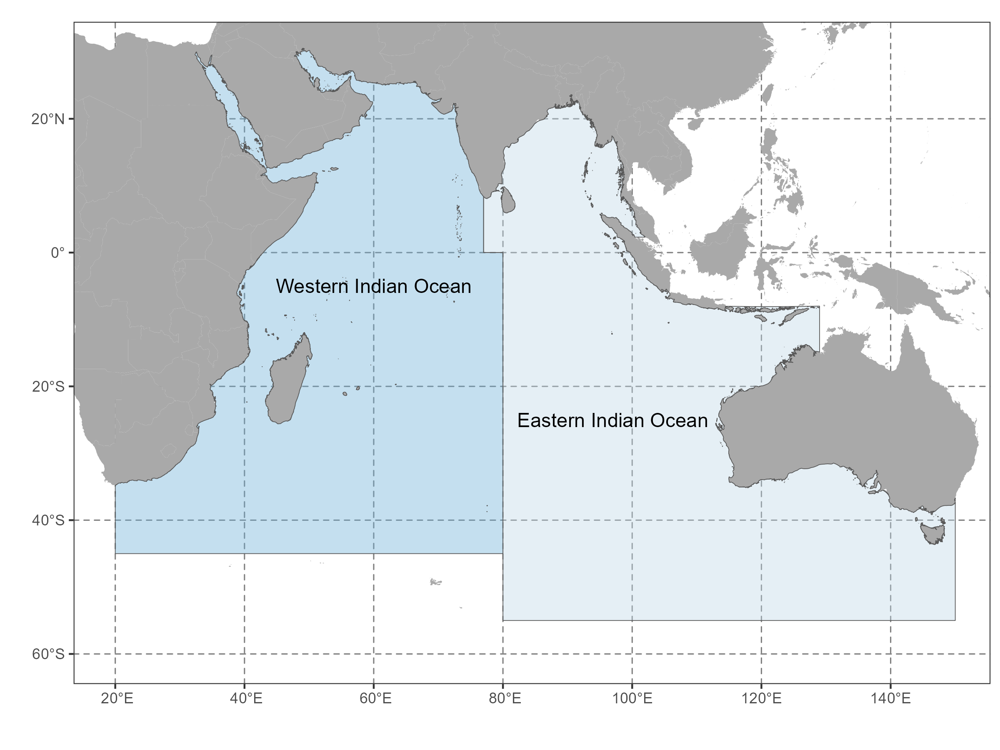

# Terminology {#TerminologySection}

Several technical terms and definitions are specific to the IOTC and key for reporting fisheries data to the Secretariat.

## Area of competence

The [IOTC area of competence](#iotcareaofcompetence) is defined in the article II of the [IOTC Agreement](#iotcagreement) and corresponds to "the Indian Ocean and adjacent seas, north of the Antarctic Convergence, insofar as it is necessary to cover such seas for the purpose of conserving and managing stocks that migrate into or out of the Indian Ocean". For statistical purposes, the IOTC area of competence is split between two [main areas](https://data.iotc.org/reference/latest/domain/admin/#IOareasMain): the Western Indian Ocean and Eastern Indian Ocean (Fig. \@ref(fig:AreaOfCompetence)).

```{r AreaOfCompetence, fig.cap = "Main areas of the IOTC area of competence", fig.asp = 0.75, width = 8}

```

## Species of interest

The 16 species and stocks managed by the IOTC – hereinafter referred as the IOTC species – are defined in the article III of the [IOTC Agreement](#iotcagreement), where the term stocks means the populations of such species which are located in the IOTC area of competence or migrate into or out of the area. It is important to note that the distribution of the stock of southern bluefin tuna (_Thunnus maccoyii_) extends over the Atlantic, Indian, and Pacific Oceans, and its actual management is under the responsibility of the Commission for the Conservation of Southern Bluefin Tuna ([CCSBT](https://www.ccsbt.org/])). For this species, the data reporting obligations defined for the IOTC species apply to the Indian Ocean component of the stock.

<!-- I find the last sentence redundant. reporting obligations are already defined by species under the IOTC management in the IOTC area of competence. maybe we can include IOTC stocks reference in the glossary?-->

```{r PrimarySpecies, fig.cap = ""}
dtfunction(PRIMARY_SPECIES) %>% formatStyle(columns = c("SPECIES_SCIENTIFIC"), fontStyle = "italic")
```

In addition, the IOTC identified a list of species, mostly composed of commonly caught [elasmobranch](#elasmobranchs) species, for which data reporting obligations apply as for the [IOTC species](#iotcspecies). The Annex 2 of Res. [15/01](https://www.iotc.org/cmm/resolution-1501-recording-catch-and-effort-data-fishing-vessels-iotc-area-competence) provides this list of species and species groups by gear group and was further complemented for all manta rays through Res. [19/03](https://iotc.org/cmm/resolution-1903-conservation-mobulid-rays-caught-association-fisheries-iotc-area-competence).

```{r OtherSpecies, fig.cap = ""}
dtfunction(OTHER_SPECIES) %>% formatStyle(columns = c("SPECIES_SCIENTIFIC"), fontStyle = "italic")
```

Res. [15/01](https://www.iotc.org/cmm/resolution-1501-recording-catch-and-effort-data-fishing-vessels-iotc-area-competence) further includes groups of Endangered, Threatened, and Protected (ETP) species that may interact with IOTC fisheries and for which data collection and reporting has been defined through specific CMMs: turtles (Res. [12/04](https://iotc.org/cmm/resolution-1204-conservation-marine-turtles)), whale sharks (Res. [13/05](https://iotc.org/cmm/resolution-1305-conservation-whale-sharks-rhincodon-typus)), cetaceans (Res. [23/06](https://iotc.org/cmm/resolution-2306-conservation-cetaceans)), and seabirds (Res. [23/07](https://iotc.org/cmm/resolution-2307-reducing-incidental-bycatch-seabirds-longline-fisheries)).

```{r ETPSpecies, fig.cap = ""}
dtfunction(ETP_SPECIES) %>% formatStyle(columns = c("SPECIES_SCIENTIFIC"), fontStyle = "italic")
```

Finally and while optional, the reporting of statistics for all other bycatch species is encouraged to monitor the ecosystem effects of fishing, especially when the catches of these species represent a significant proportion of the total catches of the fishery concerned.

## Fishing fleet {#fishingfleet}

A fishing fleet is a group of fishing vessels that may operate in the [IOTC area of competence](#iotcareaofcompetence) and whose fishing operations and catches of tuna and tuna-like species are under the responsibility of a political entity or sub-entity recognized by the IOTC. The fishing fleet is derived from the combination of the flag state and reporting entity (see section on [Reporting metadata](#MetadataSection)). In most cases, the fishing fleet corresponds to the flag state but some differences stem from: (i) when the CPC is composed of multiple entities (i.e., European Union (EUR) and China (CHN)), (ii) the cases of France Overseas Territories (FRAT) and British Indian Overseas Territories (GBRT), and (iii) the existence of estimates of unreported catches not included elsewhere (e.g., NEI.PS) that need to be accounted for in the IOTC process.  

## Fishery categories {#fisherycategories}

The three main IOTC fishery categories are defined according to the main gear used by the vessel and their recording in the IOTC Record of Authorised Vessels ([RAV](#rav)): (i) [longline fisheries](#iotclonglinefishery), (ii) [surface fisheries](#iotcsurfacefishery), and (iii) [coastal fisheries](#iotccoastalfishery), also called [artisanal fisheries](#iotcartisanalfishery) (see footnote 1 of IOTC Res. [15/02](https://www.iotc.org/cmm/resolution-1502-mandatory-statistical-reporting-requirements-iotc-contracting-parties-and)). The IOTC data reporting obligations defined through the [CMMs](#cmm) vary according to the fishery categories.

## Fisheries {#fisheries}

The IOTC fisheries are derived from the combination of several factors: (i) the [fishery purpose](../domain/fisheries/#fisheryPurposes), (ii) the [area of operation](../domain/fisheries/#fisheryAreasOfOperation), (iii) the [vessel size range](../latest/domain/fisheries/#fisheryLOAClasses), (iv) the [gear group](../domain/fisheries/#gearGroups), (v) the [gear](../domain/fisheries/#gears), (vi) the [gear configuration](../domain/fisheries/#gearConfigurations), (vii) the [fishing mode](../domain/fisheries/#fishingModes) in the case of purse seines, hooks and lines, and pole-and-lines, and (viii) the [target species](../domain/fisheries/#targetSpecies). The [IOTC fishery identification wizard](https://iotc.org/data/fisheries/wizard) has been designed to guide the adoption of the new fishery classification by providing an interactive tool which generates the code and definition of the fishery based on the aforementioned factors.